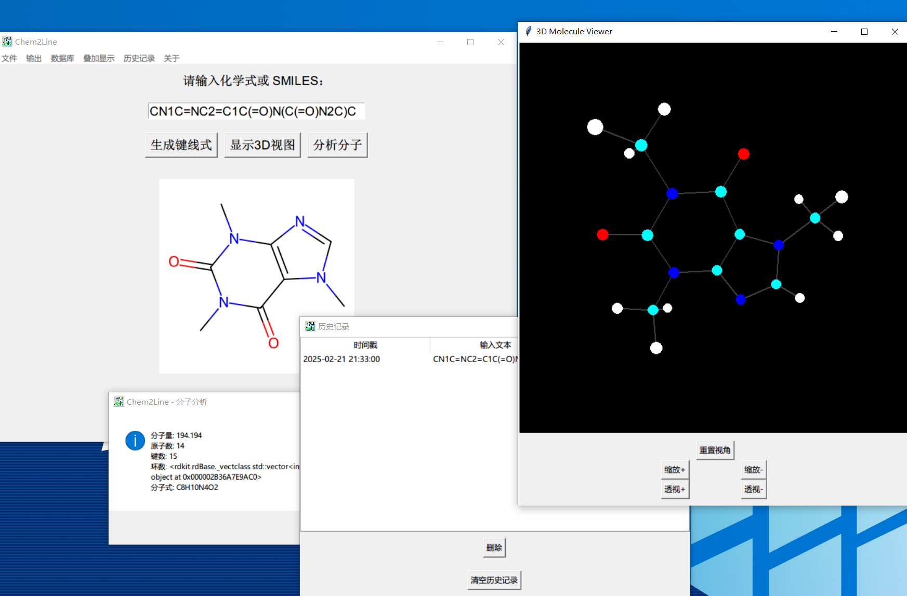

<div align="center">
<p></p>
<h2>Chem2Line</h2>
<p>在你的电脑生成有机物的键线式！</p>
<p><em>Generate key line formulas for organics at your computer!</em></p>
</img>
</div>


[中文版](README.md) | [English Version](README-English.md) | 

# Chem2Line


[](https://github.com/Ziyang-Bai/Chem2Line/actions/workflows/build.yml)
[](https://github.com/Ziyang-Bai/Chem2Line/actions/workflows/release.yml)

**Chem2Line** 是一个用于将化学式或 SMILES 表示转换为键线式图像的工具。用户可以输入化学式或 SMILES，程序将生成相应的化学结构图像。程序支持更换数据库、显示数据库信息，以及保存生成的图像。

**功能**

- **化学式转键线式**：用户可以输入化学式或 SMILES 表示，程序将自动生成对应的键线式图像。
- **数据库管理**：支持加载 XML 格式的 SMILES 数据库，可以更换数据库，查看当前数据库信息。
- **保存图像**：可以将生成的键线式图像保存为 PNG 或 SVG 格式。
- **关于开发者**：提供开发者信息、软件版本及内核版本等详细介绍。
- **进度显示**：在加载数据库时显示进度条。
- **多语言支持**：支持简体中文，美式英语，法语，德语。
- **错误代码**：解决问题从未如此简单！
- **3D分子视图**: 纯纯自研，空间极小，资源极少，能用就行。
- **调试工具**：运行时加上`--debug`参数即可开始调试。
- **历史记录**: 我刚刚查了啥来着？
- **力场优化**: 虽然位置不太对头。


截图


不太对的力场优化 但是至少有氢了

**安装与依赖**

本工具需要以下 Python 库：

- tkinter：用于创建图形用户界面。
- PIL（或 Pillow）：用于处理和显示图像。
- rdkit：用于化学信息学操作。

```bash
pip install pillow
pip install tk
pip install rdkit
```

**使用方法**

**1. 启动程序**

运行程序后，会显示一个主界面，您可以输入化学式或 SMILES 表示，点击“生成键线式”按钮查看结果。

**2. 更换数据库**

点击菜单栏中的“数据库”>“更换数据库”，选择一个新的 XML 格式数据库。程序会自动加载数据库并显示加载进度。

如果你希望能够快捷的调用常用的数据库，请将其放在`lib/db`目录下。默认数据库可通过`config.xml`或配置窗口进行更改。但必须在`lib/db`目录下。修改`config.xml`无此限制，但不推荐这么操作。

**2.1. 数据库格式**

数据库采用XML格式。标准格式如下。

```xml
<smiles_database>
    <!--name publisher description为可选元素-->
    <name>标准数据库</name>
    <publisher>Ziyang-Bai</publisher>
    <description>这是一行备注</description>
    <compound>
        <!--name和cas也可以填写任意字符，但smiles和formula是必须的。-->
        <name>苯</name>
        <smiles>c1ccccc1</smiles>
        <formula>C6H6</formula>
        <cas>71-43-2</cas>
    </compound>
</smiles_database>
```
    
你可以根据需要添加或删除元素。如果你有sdf格式的数据库，可以使用sdf_converter.py将其转换为xml格式。但是需要进行一些修改，具体请查看sdf_converter.py文件。

**2.2. 下载已存在的数据库**

这里有一些数据库供下载，你可以直接下载并解压后使用。
| 数据库名称 | 下载地址 |
|-----------|---------|
| 默认数据库|[下载](https://github.com/Ziyang-Bai/Chem2Line/blob/main/lib/db/default_database.xml) |
| PubChem含碳有机物|[下载](https://github.com/Ziyang-Bai/Chem2Line/blob/main/databases/pubchem_carbon.xml.tgz) |
| PubChem所有物质|[下载](https://github.com/Ziyang-Bai/Chem2Line/blob/main/databases/pubchem_full.xml.tgz)

**2.3. 提交你的数据库**

如果你有自己收集的数据库，并且希望分享给其他人，你可以按照以下步骤操作：

1. 将你的数据库文件命名为 `your_database.xml` 

2. 创建一个属于你的fork，并将你的数据库文件上传到`databases`目录下。

3. 创建一个 Pull Request，将你的数据库文件合并到主仓库中。记得说明你的数据库名称和简介。

**3. 保存键线式图像**

点击菜单栏中的“文件”>“保存图像”>“保存为PNG”或“保存为SVG”，选择保存位置并保存生成的键线式图像。

**4. 查看数据库信息**

点击菜单栏中的“数据库”>“关于数据库”，程序会显示当前加载的数据库信息。

**5. 关于开发者**

点击菜单栏中的“关于”>“开发者”，查看开发者信息和软件版本等。

**6. 提交自己的语言文件**

如果您希望为 Chem2Line 提交新的语言文件，请按照以下步骤操作：

1. 在 `lang` 目录下创建一个新的 XML 文件，文件名为语言代码（例如 `fr_fr.xml`）。
2. 在 XML 文件中定义界面文本的翻译，例如：
    ```xml
    <language>
        <input_label>Veuillez entrer une formule chimique ou SMILES :</input_label>
        <submit_button>Générer Bondline</submit_button>
        <save_image>Enregistrer l'image Bondline</save_image>
        <exit>Quitter</exit>
        <change_database>Changer de base de données</change_database>
        <database_info>À propos de la base de données</database_info>
        <developer>Développeur</developer>
        <repository>Référentiel</repository>
        <file>Fichier</file>
        <database>Base de données</database>
        <about>À propos</about>
        <language>Langue</language>
        <english>Anglais</english>
        <chinese>Chinois</chinese>
    </language>
    ```
3. 在 `config.xml` 文件中添加新的语言代码，例如：
    ```xml
    <config>
        <language>zh_cn</language>
        <available_languages>
            <language>zh_cn</language>
            <language>en_us</language>
            <language>fr_fr</language>
        </available_languages>
    </config>
    ```
4. 提交您的更改并创建一个 Pull Request。

## 错误代码

在使用过程中，您可能会遇到以下错误代码：

- **1000**：未知错误
- **1001**：未找到结果
- **1002**：生成失败
- **2000**：配置加载错误
- **2001**：配置保存错误
- **3000**：语言加载错误
- **1999**：未定义

## 改进

1. __用户体验__
    - ~~增加对无效化学式或 SMILES 的输入检查，并给出具体的错误提示。~~
    - ~~支持最近使用的化学式或 SMILES 历史记录。~~
2. __代码结构__
    - ~~提取 GUI 逻辑为独立函数，进一步分离核心逻辑和用户界面逻辑。~~
    - ~~使用多线程处理图像生成，避免主界面阻塞。~~
3. __数据库扩展__
    - 增加对更多数据库格式（如 JSON、CSV）的支持。
    - 提供内置的默认化学式和 SMILES 示例。
4. __功能扩展__
    - ~~增加 3D 分子可视化功能。~~
    - 提供键线式的图像旋转和放大缩小功能。
    - ~~支持导出为矢量图（SVG）。~~

- __性能瓶颈__：~~对于较大的 XML 数据库文件，加载和解析可能会有延迟，优化文件读取方式或引入索引。~~
- __依赖性问题__：~~需要确保用户安装了 RDKit 和其他依赖库。~~
- __兼容性问题__：Tkinter 在某些系统上的表现可能受限，提供基于 Web 的交互界面版本。

**许可证**

该程序使用 Apache-2.0 许可证，请参考 LICENSE 文件获取更多信息。

# 构建
## 预构建版本
请在Github Releases 页面下载预构建版本。
## Github Action 快捷构建
当你得到属于你的Github仓库克隆之后，你可以使用Github Action 快捷构建来构建你的程序。
只需点击仓库右上角的 "Actions" 按钮，然后选择 "Build CTLGUI Executable" 工作流。运行工作流程或随意制造一个新的提交，然后等待构建完成。
等待构建完成，然后你可以在 "Actions" 页面找到生成的可执行文件。
## 手动构建
随后，你可以使用以下命令手动构建你的程序：
```bash
git clone https://github.com/Ziyang-Bai/Chem2Line.git
cd Chem2Line
python -m venv myenv
myenv\Scripts\activate  # 在 Windows 上
# source myenv/bin/activate  # 在 macOS 和 Linux 上
pip install --upgrade pip wheel
pip install -r requirements.txt
pip install rdkit
pip install nuitka
python -m nuitka --standalone --onefile --enable-plugin=tk-inter --windows-icon-from-ico=lib/media/nctl.ico --output-dir=dist --follow-imports --include-data-files=lib/media/*=lib/media/ --remove-output --show-progress --lto=yes --jobs=16 --windows-console-mode=disable c:/Users/Danie/Documents/GitHub/Chem2Line/ctlgui.py
```
这将使用你当前Python环境中的所有依赖项构建Chem2Line。

# 错误报告/联系
创建一个Issue即可报告错误，或使用Telegram群组亦可[](https://t.me/Chem2Line)
